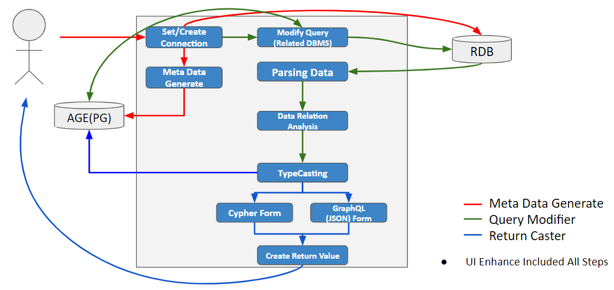

<h2>What is This Project</h2>

This Project is an API that executes queries in Cypher or Graph QL 
format on RDBs such as PostgreSQL, Oracle, and MySQL and returns the results to the user in the form of the requested query.

At this time, through AGE Storage, integrated metadata can be managed regardless of RDB type such as Oracle, MySQL, and MSSQL, and data query is supported through Open Cypher/GraphQL without the need to change the core at the RDB level.
It can also provide usefulness in terms of analysis through result visualization tailored to Open Cypher/GraphQL.
 
 
<h2>Overview</h2>

Currently, this Project will develop :

- **Meta Data Generator** : After connection, table is converted to node and 
  1. created / edge is created based on constraints 
  2. Part that implements logic to check update information when a connection 
     exists 
  3. Metadata management (select only desired tables) Must be managed by 
     graph  
- **Query Modifier** : R&D on query conversion unit in progress 
  1. Cypher -> Target DB Query conversion 
  2. GraphQL -> Target DB Query conversion 
  3. Identify and preserve target DB type 
  4. Created Query and Cypher/GraphQL mapping management function    
- **Return Caster** : A part that implements the function of converting data 
  received through a query converted from the Query Modifier to fit the 
  initially requested form.  

We plan to develop it on a web basis, and it will be based on the contents below. 

1. UI support and advancement for connection and query conversion functions 
2. Enhanced connection data front logic 
3. Add Query Modifier related interface 
4. Apply Return Casting result UI 
  

<h2>Architecture Concept</h2>

 
 
1. Set Connection/Create Connection 
   Achieve Connection Information using IP, Port, Database, ID, Password and so on
   Meta Data Generate 
   Table and Relation Table created to AGE node form(Reference) 
   Edge Created based on FK Constrainment(Reference) 
    
2. Modify Query(Related DBMS) 
   Receive Cypher/GraphQL requested by user 
   At this time, analyze the relationship between tables described in the query by referring to the meta data stored in AGE. 
   Conversion work progresses through query analysis logic 
   Cypher/GraphQL type determination 
   Converted to SQL Form. Save to AGE with original query (Cypher/GraphQL) 
    
3. Perform converted query 
   Data acquisition and listing performance 
   Relationship analysis: Node/edge relationship analysis through each key and relationship analysis 
   Identify edge start/end point relationships 
   Analysis of connection relationships between tables 
    
4. Return the result data after converting it into the query form requested by the user. 
    
<h2>Documentation</h2>
Related documents are being prepared.
 
